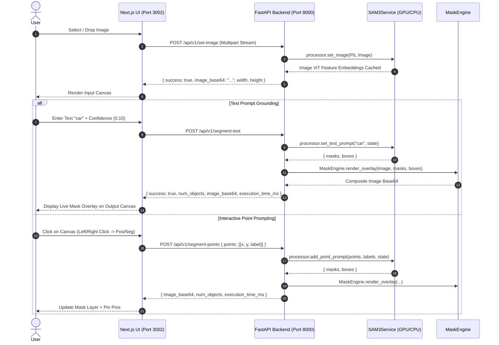

# Meta Segment Anything Model 3 (SAM 3) — Full Project Context & Architecture Guide

> **Target Audience:** AI Coding Assistants (LLMs, Cursor, Antigravity, Copilot) & Software Engineers.  
> **Repository Purpose:** Production-grade web interface and decoupled REST API for Meta SAM 3 (Segment Anything 3) open-vocabulary concept segmentation and interactive point-prompting.

---

## 1. Project Overview & Tech Stack

| Component | Technology | Purpose |
| :--- | :--- | :--- |
| **Model Engine** | Meta SAM 3 (`sam3.pt`, 3.45 GB) | Vision Foundation model for Open-Vocabulary Grounding & Interactive Point Masking |
| **Backend API** | Python 3.11, FastAPI, Uvicorn, PyTorch | Asynchronous REST service for image embedding caching, mask rendering, and device management |
| **Mask Processing** | OpenCV / PIL / NumPy Vectorized Engine | Color-palette mask alpha blending, bounding box labeling, and Base64 stream encoding |
| **Frontend UI** | Next.js 14 (App Router), Tailwind CSS, Lucide | Responsive dual-pane canvas (Input Left / Output Right), point pin overlays, upload progress tracking |
| **Hardware** | NVIDIA CUDA (GPU) & CPU Fallback | Dynamic hot-swapping between CUDA GPU and CPU execution |

---

## 2. Complete Repository Directory Structure

```text
Segmentation_model_by_meta/
├── .cursorrules                         # AI IDE context rule definition
├── PROJECT_CONTEXT.md                   # Complete LLM/developer reference (this file)
├── ARCHITECTURE.md                      # Detailed data flow, schemas & system architecture
├── README.md                            # Main project overview & quickstart
├── download_sam3.py                     # Checkpoint downloader script from Hugging Face
│
├── sam3/                                # Meta SAM 3 Core Architecture (Engine Submodule)
│   ├── checkpoints/
│   │   └── sam3.pt                      # 3.45 GB Model Weights
│   ├── sam3/                            # Python model builder & predictors
│   │   ├── model_builder.py             # build_sam3_image_model() factory
│   │   ├── model/                       # ViT backbone, memory, necks, attention
│   │   └── sam3_image_processor.py      # Sam3Processor (set_image, set_text_prompt, add_point_prompt)
│   └── app.py                           # Legacy Gradio reference implementation
│
└── web_app/                             # Decoupled Full-Stack Application
    ├── launch_all.bat                   # 1-Click launcher starting both Backend & Frontend
    ├── README.md                        # Web app specific documentation
    │
    ├── backend/                         # FastAPI Python Backend
    │   ├── requirements.txt             # Python backend dependencies
    │   ├── run.py                       # Server entrypoint with custom sys.path prioritization
    │   └── app/
    │       ├── __init__.py
    │       ├── config.py                # Pydantic Settings, dynamic paths & CORS configuration
    │       ├── main.py                  # FastAPI Application Factory with lifespan model preloader
    │       ├── core/
    │       │   ├── __init__.py
    │       │   ├── logger.py            # Production structured logging (sam3.server, sam3.model, sam3.api)
    │       │   ├── sam3_service.py      # Singleton managing model lifecycle, GPU cache & session state
    │       │   └── mask_engine.py       # High-performance alpha mask blending & BBox rendering
    │       ├── schemas/
    │       │   ├── __init__.py
    │       │   └── requests.py          # Strict Pydantic models for API validation
    │       └── api/
    │           ├── router.py            # Root API router aggregation
    │           └── v1/
    │               ├── endpoints_health.py        # GET /api/v1/health & POST /api/v1/device/switch
    │               ├── endpoints_image.py         # POST /api/v1/set-image & POST /api/v1/reset
    │               ├── endpoints_segment_text.py  # POST /api/v1/segment-text
    │               └── endpoints_segment_point.py # POST /api/v1/segment-points
    │
    └── frontend/                        # Next.js 14 Modern Web UI
        ├── package.json                 # Node dependencies (Next.js, Tailwind, Lucide)
        ├── tailwind.config.js           # Theme extensions & responsive breakpoints
        └── src/
            ├── app/
            │   ├── layout.js            # Root HTML layout & fonts
            │   ├── globals.css          # Dark slate theme & glassmorphism utilities
            │   └── page.js              # Full-width main workspace
            ├── components/
            │   ├── common/
            │   │   ├── Header.js        # Navbar with model status badge & device selector
            │   │   ├── DeviceSelector.js# Interactive CUDA GPU vs CPU target switcher
            │   │   └── Badge.js         # Status badge pill component
            │   ├── canvas/
            │   │   ├── InteractiveCanvas.js # Dual-pane input & output image view with point pins
            │   │   └── CanvasControls.js    # Image meta, reset button & PNG mask export
            │   ├── panels/
            │   │   └── ControlPanel.js  # Text prompt tab & Interactive point prompt controls
            │   └── metrics/
            │       └── StatusLogger.js  # Latency, object counts & operation log stream
            ├── hooks/
            │   ├── useBackendHealth.js  # 5s polling hook for API availability & device status
            │   └── useSamSession.js     # Session manager for image uploads, masks, points & undo
            └── lib/
                ├── api.js               # XMLHttpRequest client with real-time upload progress %
                └── constants.js         # Click modes, suggested prompt tags & backend URLs
```

---

## 3. Core Architecture & Data Flow



---

## 4. REST API Endpoint Reference

| Method | Endpoint | Description | Request Payload | Response Schema |
| :--- | :--- | :--- | :--- | :--- |
| `GET` | `/api/v1/health` | Backend status, active device, and model load state | None | `HealthResponse` |
| `POST` | `/api/v1/device/switch` | Dynamically reloads model on `"cuda"` or `"cpu"` | `{"device": "cuda"\|"cpu"}` | `DeviceSwitchResponse` |
| `POST` | `/api/v1/set-image` | Uploads image and computes visual embeddings | `multipart/form-data (file)` | `{ success, image_base64, width, height }` |
| `POST` | `/api/v1/segment-text` | Ground concepts by text prompt with confidence slider | `{"prompt": "person", "confidence": 0.10}` | `SegmentationResponse` |
| `POST` | `/api/v1/segment-points` | Interactive positive/negative point segmentation | `{"points": [{"x": 0.5, "y": 0.5, "label": 1}]}` | `SegmentationResponse` |
| `POST` | `/api/v1/reset` | Resets active image session cache in memory | None | `{"success": true}` |

---

## 5. Development & Execution Instructions

### Prerequisites
- Python 3.11 with PyTorch 2.5+ & CUDA 12.1+ (or CPU fallback)
- Node.js 18+ & npm
- SAM 3 Checkpoint: Located at `sam3/checkpoints/sam3.pt`

### 1-Click Launch (Windows)
Double-click [`web_app/launch_all.bat`](file:///e:/AI/Segmentation_model_by_meta/web_app/launch_all.bat) or run from terminal:
```cmd
cd web_app
launch_all.bat
```

### Manual Individual Commands

#### Backend:
```bash
cd web_app/backend
python run.py
# Server running on http://127.0.0.1:8000
# Interactive Swagger Docs on http://127.0.0.1:8000/api/v1/docs
```

#### Frontend:
```bash
cd web_app/frontend
npm install
npm run dev
# App running on http://localhost:3000 (or auto-fallback 3001, 3002)
```

---

## 6. Guidelines for AI Assistants & LLMs

1. **Namespace Isolation:** Never import `app` from the top level without ensuring `web_app/backend` is at `sys.path[0]` (because `sam3/app.py` has a naming clash with `backend/app`).
2. **Coordinate Normalization:** Point prompts sent to the backend MUST be normalized in the range $[0.0, 1.0]$ (`x = px / width`, `y = py / height`).
3. **Structured Logging:** Always use `app.core.logger` (`logger`, `model_logger`, `api_logger`) rather than raw `print()` statements.
4. **Memory Management:** When switching devices or reloading models, call `torch.cuda.empty_cache()` and `gc.collect()`.
5. **No Suppression of Warnings:** Fix the root causes of deprecations in code directly rather than suppressing with `warnings.filterwarnings`.
