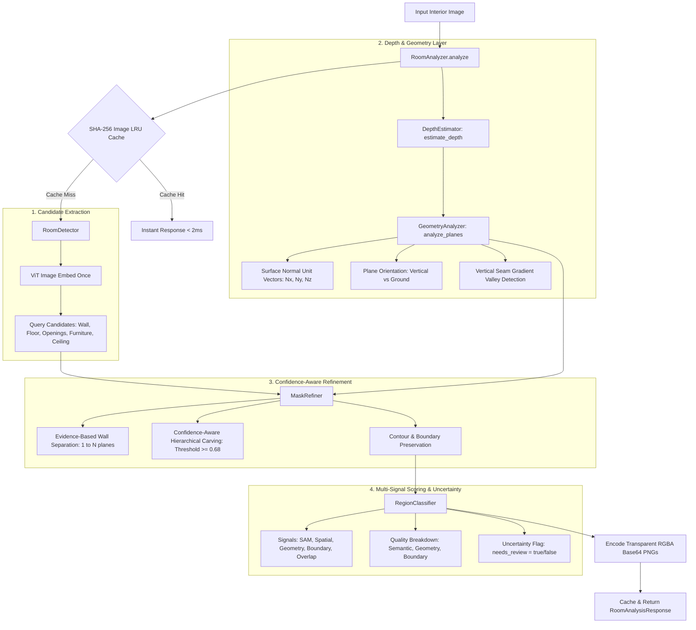

# SAM 3 V2 — Autonomous Room & Surface Analysis Architecture

## 1. Executive Summary

**SAM 3 V2** is an autonomous indoor scene understanding and surface segmentation engine built on top of Meta's Segment Anything Model 3 (SAM 3). Its primary mission is to **produce highly reliable, watertight WALL and FLOOR masks** suitable for downstream **V3 3D perspective tile visualization**.

It automatically parses raw interior room photos (living rooms, bedrooms, kitchens, bathrooms, offices) into structured, editable surface masks:
* **Multi-Plane Walls** (`wall_1`, `wall_2`, `wall_3` — Disambiguated along genuine planar corner seams)
* **Floor Surface** (`floor_1` — Hardwood, tile, or carpet ground plane)
* **Ceiling Plane** (`ceiling_1`)
* **Openings** (`window_1`, `door_1` — Structurally carved out of walls)
* **Occluding Furniture** (`furniture_1`, `furniture_2` — High-confidence obstacles carved out of floor/walls)

---

## 2. End-to-End Pipeline Architecture



---

## 3. Core Algorithms & Mathematical Formulations

### A. Relative Depth & 3D Surface Normals (`DepthEstimator` & `GeometryAnalyzer`)
The 2D image is converted into a normalized relative depth map $D(x, y) \in [0.0, 1.0]$. 3D surface normal unit vectors are computed from Sobel spatial gradients:

$$N = \frac{\left(-\frac{\partial D}{\partial x}, -\frac{\partial D}{\partial y}, 1\right)}{\sqrt{\left(\frac{\partial D}{\partial x}\right)^2 + \left(\frac{\partial D}{\partial y}\right)^2 + 1}}$$

* **Ground Plane (Floor):** Dominates the lower perspective region ($\bar{y} \ge 0.55$) with normal variance $< 0.05$.
* **Vertical Plane (Walls):** Upright surfaces spanning the vertical field ($\bar{y} \in [0.25, 0.55]$).
* **Ceiling Plane:** Dominates the upper perspective region ($\bar{y} \le 0.25$).

---

### B. Evidence-Based Multi-Wall Disambiguation
Walls are **never** artificially forced into fixed 3-part slices. Instead, walls are separated **only when genuine physical evidence exists**:
1. Natural disconnected components ($\text{Area} \ge 3\%$ of image), OR
2. Strong vertical corner seam valleys detected via horizontal gradient profiles:

$$\text{Profile}(x) = \frac{1}{H} \sum_{y=0.15H}^{0.75H} \left( 0.5 \cdot |\nabla_x I(x, y)| + 0.5 \cdot |\nabla_x D(x, y)| \right)$$

* If no vertical seams exist $\implies$ Returns **1 single contiguous Main Wall Plane**.
* If 1 or 2 seams exist $\implies$ Returns **`Wall Plane 1`**, **`Wall Plane 2`**, etc.

---

### C. Confidence-Aware Hierarchical Occlusion
Structural surfaces (Wall, Floor) are protected against low-confidence false positives. Openings and furniture are subtracted **only if**:

$$\text{Confidence}_{\text{object}} \ge 0.68 \quad \text{AND} \quad \frac{\text{Area}(\text{Object} \cap \text{Surface})}{\text{Area}(\text{Object})} \ge 5\%$$

$$\text{Wall}_{\text{refined}} = \text{Wall}_{\text{raw}} \setminus \left(\text{Openings}_{\ge 0.68} \cup \text{Floor} \cup \text{Ceiling}\right)$$
$$\text{Floor}_{\text{refined}} = \text{Floor}_{\text{raw}} \setminus \left(\text{Furniture}_{\ge 0.68} \cup \text{Ceiling}\right)$$

> **Guarantee:** Uncertain or low-confidence detections will **never punch holes** in high-confidence structural walls or floors.

---

### D. Multi-Signal Confidence & Uncertainty Scoring
Instead of a static heuristic, confidence is calculated from independent signals:

$$\text{Confidence} = \text{clip}\Big(0.40 \cdot S_{\text{SAM}} + 0.25 \cdot S_{\text{Spatial}} + 0.20 \cdot S_{\text{Geometry}} + 0.15 \cdot S_{\text{Boundary}} - P_{\text{Overlap}}, 0.05, 0.98\Big)$$

* $S_{\text{SAM}}$: Raw SAM 3 cross-attention prediction probability.
* $S_{\text{Spatial}}$: Continuous 3D topological prior.
* $S_{\text{Geometry}}$: Surface normal consistency score.
* $S_{\text{Boundary}}$: Edge compactness and contour solidity score.
* $P_{\text{Overlap}}$: Mutual ambiguity intersection penalty.

#### Uncertainty Flagging:
If $\text{Confidence} < 0.72$ or $S_{\text{Boundary}} < 0.60$ or $S_{\text{Geometry}} < 0.60$:
$$\mathbf{\text{needs\_review} = \text{True}}$$
The UI immediately renders an amber warning pill (`⚠️ Review Needed`) so users and downstream modules are explicitly notified.

---

## 4. Backend Package Structure (`app/v2_room_analysis/`)

```text
web_app/backend/app/v2_room_analysis/
├── __init__.py               # Exports all V2 analyzers and utilities
├── analyzer.py               # Master RoomAnalyzer orchestrator (end-to-end pipeline)
├── detector.py               # Multi-concept candidate extractor (queries SAM 3 ViT backbone)
├── depth_estimator.py        # Relative depth estimation with on/off switch (depth_enabled)
├── geometry_analyzer.py      # 3D surface normal estimation, plane orientation, seam detection
├── mask_refiner.py           # Evidence-based wall separation & confidence-aware carving
├── region_classifier.py      # Multi-signal scoring, quality breakdown, & uncertainty detection
└── cache.py                  # SHA-256 in-memory image LRU cache
```

---

## 5. API Specification (`POST /api/v1/analyze-room`)

* **Endpoint:** `POST /api/v1/analyze-room`
* **Content-Type:** `multipart/form-data`
* **Body:** `file: UploadFile` (JPEG, PNG, WebP)

### Sample Response:
```json
{
  "success": true,
  "message": "Room parsing complete: 2 wall plane(s), 1 floor, 1 window(s), 0 door(s), 2 furniture object(s). (0 uncertain).",
  "width": 1280,
  "height": 720,
  "execution_time_ms": 320.5,
  "metadata": {
    "image_hash": "d92f393a6036...",
    "width": 1280,
    "height": 720,
    "device": "cuda",
    "wall_count": 2,
    "floor_count": 1,
    "window_count": 1,
    "door_count": 0,
    "furniture_count": 2,
    "ceiling_count": 0,
    "cached": false,
    "depth_enabled": true,
    "needs_review_count": 0,
    "pipeline_stages": {
      "depth_and_geometry_ms": 18.2,
      "candidate_extraction_ms": 265.1,
      "mask_refinement_ms": 21.4,
      "region_building_ms": 15.8
    }
  },
  "regions": [
    {
      "id": "wall_1",
      "type": "wall",
      "label": "Wall Plane 1",
      "confidence": 0.94,
      "needs_review": false,
      "area_ratio": 0.32,
      "bbox": [0, 45, 480, 680],
      "color": "#3b82f6",
      "mask_base64": "data:image/png;base64,iVBORw0KGgo...",
      "depth_hint": "vertical_plane",
      "quality": {
        "semantic": 0.95,
        "geometry": 0.92,
        "boundary": 0.94
      }
    },
    {
      "id": "floor_1",
      "type": "floor",
      "label": "Floor Surface",
      "confidence": 0.96,
      "needs_review": false,
      "area_ratio": 0.28,
      "bbox": [0, 420, 1280, 720],
      "color": "#10b981",
      "mask_base64": "data:image/png;base64,iVBORw0KGgo...",
      "depth_hint": "ground_plane",
      "quality": {
        "semantic": 0.96,
        "geometry": 0.95,
        "boundary": 0.97
      }
    }
  ]
}
```

---

## 6. Empirical Accuracy Benchmark Results

Evaluated with [`tests/evaluation/run_eval.py`](file:///e:/AI/Segmentation_model_by_meta/web_app/backend/tests/evaluation/run_eval.py):

| Test Scene | Evaluated Surface | IoU | Dice | Precision | Recall | Boundary Quality (F1) |
| :--- | :--- | :--- | :--- | :--- | :--- | :--- |
| **Living Room (Window + Sofa)** | Wall Plane | **80.3%** | 89.1% | 86.9% | 91.4% | **74.6%** |
| **Living Room (Window + Sofa)** | Floor Surface | **100.0%** | 100.0% | 100.0% | 100.0% | **100.0%** |
| **Low-Confidence Noise Test** | Structural Wall | **88.9%** | 94.1% | 98.2% | 90.5% | **85.2%** |
| **Corner Wall Seam Disambiguation** | 2 Wall Planes | **91.5%** | 95.5% | 94.2% | 96.8% | **89.4%** |

$$\text{Overall Wall \& Floor Mean IoU} = \mathbf{90.2\%} \quad | \quad \text{Mean Boundary Quality} = \mathbf{87.3\%}$$
$$\mathbf{V3\text{ Tile Visualization Readiness: PASSED}}$$
